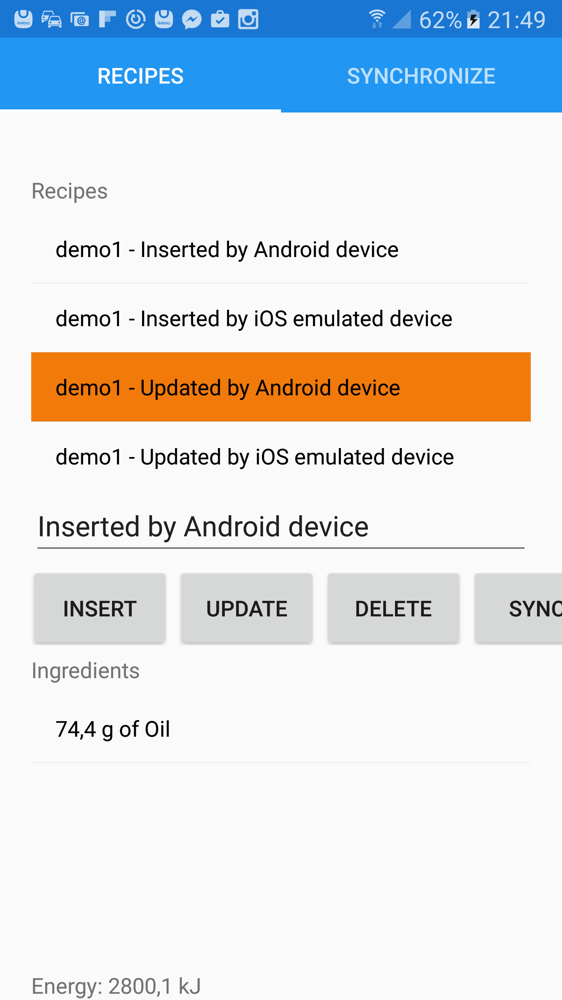

# Mobile Synchronization

This project enables Xamarin apps to synchronize their SQLite databases with a database behind a REST service.

## Features
* Bidirectional synchronization
* Supports read, insert, update and delete operations on server or client site
* Supports authentication
* Supports authorization (read public records, insert, update and delete records owned by authenticated user or admin)
* Your job: describe your business model in JSON -- server and client are ready to run
 
Four projects are included
* A generator - takes your model and creates Java classes, C# classes and the required database
* A server - ready to run with the generated classes
* A PCL (Portable Class Library) - ready to be used in a Xamarin project to synchronize database content
* Two examples, one generic and a "Recipes" example, containing a model and a Xamarin app

## The Recipe Example
Recipes, owned by public or authenticated user, contain foods as ingredients.
20 recipes are owned by 'Public', 4 by demo1 and 5 by demo2.
The Xamarin app can insert, update and delete recipes and synchronize these changes.

## Getting Started
(Here for using Eclipse, Visual Studio or Xamarin Studio, an Android or iOS device in Emulator or as real device in your LAN)

1) Install PostgreSQL

2) In the `recipe-example` project create a file `src/main/resources/your.gitignored.properties` and enter at least
* url=
* user=
* password=

(For further information see `example.your.gitignored.properties`)

The user must have privileges to create database objects. Running this example will create a schema "recipe-1.0.0". 

**With Eclipse**   
3) Create a first run configuration (Java Application)
* Tab: Main
 * Project: `recipe-example`
 * Main class: `recipe.example.MobileSynchronizationGenerator`
* Tab: Arguments
 * Working directory - Other: ${workspace_loc:parent}

4) Run this run configuration
 
5) Create a a second run configuration (Java Application)
* Tab: Arguments
 * Project: `mobile-synchronization-server`
 * Main class: `msync.Server`

6) Refresh the project and run this run configuration - The server starts listening on port 8080

**Without Eclipse**   
3) Execute
* `mvn clean install`
* `java -jar mobile-synchronization-server/target/recipe-1.0.0.war`

**And The Mobile Client**   
7) Open mobile-synchronization/Models/Models.sln with Visual/Xamarin Studio
* Build (Only once per workspace)

8) Open mobile-synchronization/MSync/MSync.sln with Visual/Xamarin Studio
* Build (Only once per workspace)

9) Open mobile-synchronization/RecipeExample/RecipeExample.sln with Visual/Xamarin Studio
* (For some reason you'll receive a "Build action EmbeddedResource..." error message. Close solution and open it again)
* Choose Android or iOS
* Choose device (real or emulated)
* run

10) In the running app on tab "SYNCHRONIZE"
* Logon as demo1/demo1
* Synchronize
* You'll see recipies of Public and demo1

  
  

### Prerequisites

* PostgreSQL
* Java 8
* Maven
* Visual Studio with Xamarin or Xamarin Studio

## Contributing

Welcome!

## Authors

* **Georg Causin** - *Initial work*

## License
Copyright 2017 Georg Causin

Licensed under the Apache License, Version 2.0 (the "License");
you may not use this file except in compliance with the License.
You may obtain a copy of the License at

    http://www.apache.org/licenses/LICENSE-2.0

Unless required by applicable law or agreed to in writing, software
distributed under the License is distributed on an "AS IS" BASIS,
WITHOUT WARRANTIES OR CONDITIONS OF ANY KIND, either express or implied.
See the License for the specific language governing permissions and
limitations under the License.

